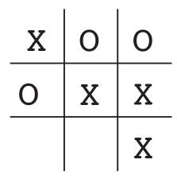

 # 第一章 导论

强化学习作为机器学习的一个重要组成部分，是人工智能三大学派之一行为主义学派的主要理论方法。相比于有监督算法学习标注数据标签的推断能力、无监督学习寻找原生数据的隐含结构，强化学习则通过“行为”来试错和不断反馈机制来学习、达成序列决策行为的动态和长期效益。目前已经在众多领域获得了较好的应用。针对强化学习的概念介绍现有信息很多，此处不再赘述。

## 本节目录

下面我们回顾一下本书中的案例，井字棋小游戏。

如上图所示，两个玩家轮流在一个3$\times$3的棋盘上下棋，一方下X,一方下O，直到其中的一方在行、列或者对角线上占据三个字（如上图的X玩家），则该方获胜。如果棋盘被占满后没有任何一方有连续三个连着的棋子，那么游戏为平局。

1. [习题解答](习题解答.md)
1. [井字棋小游戏代码](代码案例.md)
